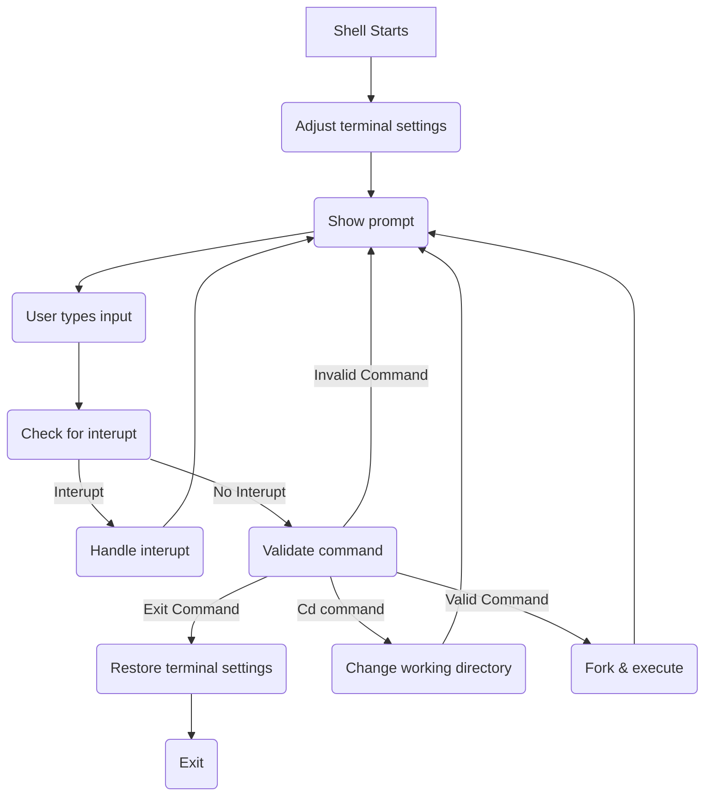

# BenSH - Ben's Shell

A shell written with my common use cases in mind.

## Features

- Run any command on `PATH`.
- `exit`
- `cd`

## Known Bugs :bug: :beetle: :cricket:

- [#1 Arrow Keys Combined With Backspace Can Remove Prompt](https://github.com/https123456789/bensh/issues/1)

## To Do

- Add shell scripting
- Add configuration files
- Add pipes and I/O redirection
- Add `history` command
- Add `info` command
- Add up and down arrow history movement
- Add left and right arrow comamnd editing
- Add signals for commands
- Fix prompt bug ([#1](https://github.com/https123456789/bensh/issues/1))

## Design

