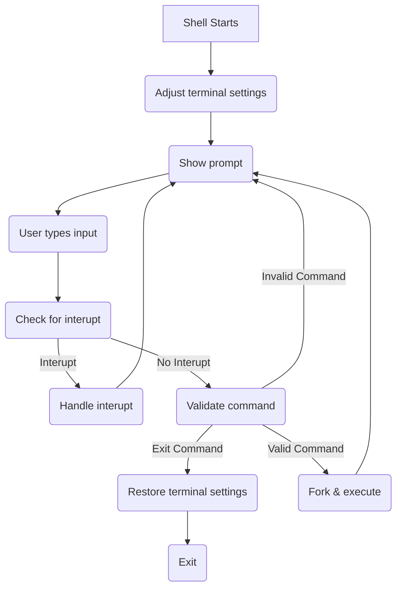

# BenSH - Ben's Shell

A shell written with my common use cases in mind.

## Design

```mermaid
graph TD
    A[Shell Starts] --> B(Adjust terminal settings)
    B --> C(Show prompt)
    C --> D(User types input)
    D --> E(Check for interupt)
    E -->|Interupt| F(Handle interupt)
    E -->|No Interupt| G(Validate command)
    F --> C
    G -->|Exit Command| I(Restore terminal settings)
    I --> J(Exit)
    G -->|Valid Command| H(Fork & execute)
    G -->|Invalid Command| C
    H --> C
```